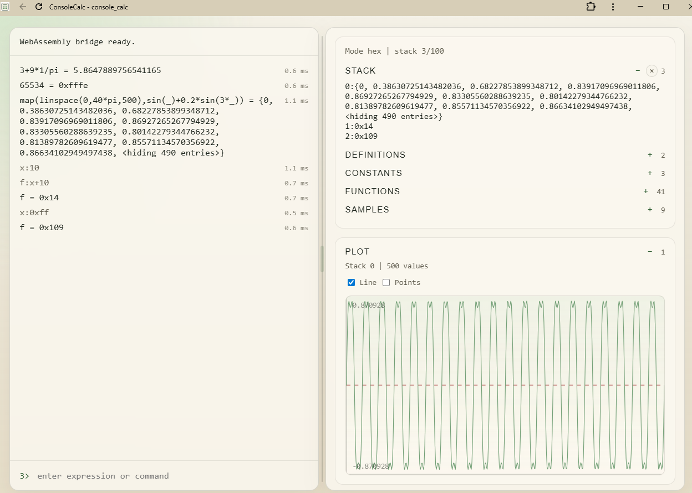

# console_calc

`console_calc` is a small command-line calculator with:
- one-shot expression evaluation
- an interactive console mode
- scalar and list values
- late-bound user definitions in console mode

The project is intentionally compact and library-first. Parsing and evaluation live in the core library, while REPL behavior stays in the app layer.
It is also intended to remain a focused personal tool for lightweight calculator workflows, not a general-purpose framework or platform.

Sample screenshot:


Current build layers:
- `console_calc_lib`
  core parser, evaluator, values, and builtin metadata
- `console_calc_runtime_lib`
  shared runtime/session logic, listings, environment expansion, and provider abstractions
- `console_calc_host_lib`
  host-facing binding facade over the runtime/session layer
- `console_calc`
  terminal application, built only when terminal-app support is enabled

## Quick Start

Evaluate a single expression:

```bash
./build/default/console_calc "2 + 3 * 4"
```

Start interactive console mode:

```bash
./build/default/console_calc
```

Build the host-facing reusable slice without the terminal application:

```bash
cmake --preset host-only
cmake --build --preset host-only
ctest --preset host-only
```

This preset is the current “WASM-ready” build boundary. It keeps the core,
runtime, and host-facing facade while excluding terminal-only code such as the
line editor and console executable.

Build the first Emscripten/WASM host artifact:

```bash
source ~/emsdk/emsdk_env.sh
EM_CACHE="$PWD/build/emscripten-cache" cmake --preset emscripten-host
EM_CACHE="$PWD/build/emscripten-cache" cmake --build --preset emscripten-host
```

This produces:
- `build/emscripten-host/console_calc.mjs`
- `build/emscripten-host/console_calc.wasm`

The current wasm bridge exports a small C-facing session API for creating a
session, submitting commands, and retrieving the last command result as JSON.

Run the web frontend during development:

```bash
cd web
npm install
npm run dev
```

The Vite app expects the wasm host artifact from the repository root to exist
first. In local development, open the Vite URL it prints, or the reverse-proxied
`/cc/` route if you use that setup.

## Running

Native console app:

```bash
cmake --preset default
cmake --build --preset default
./build/default/console_calc
```

One-shot evaluation:

```bash
./build/default/console_calc "2 + 3 * 4"
```

Browser frontend:

```bash
source ~/emsdk/emsdk_env.sh
EM_CACHE="$PWD/build/emscripten-cache" cmake --preset emscripten-host
EM_CACHE="$PWD/build/emscripten-cache" cmake --build --preset emscripten-host
cd web
npm install
npm run dev
```

## Install As App

The web frontend can be installed as a lightweight standalone app window when
served from `https` or `localhost`.

Chrome:
- Open the web app.
- Use `...` -> `Cast, save, and share` -> `Install page as app`.

Edge:
- Open the web app.
- Use `...` -> `Apps` -> `Install this site as an app`.

Safari:
- Safari does not offer the same Windows-style install flow.
- On macOS/iOS you can use `Share` -> `Add to Dock` or `Add to Home Screen`
  when available, but behavior differs from Chrome/Edge app installs.

## Expression Language

Supported values:
- intrinsic integer and floating-point scalars
- lists like `{1, 2, 3}`

Supported operators:
- unary `-`, `~`
- binary `+`, `-`, `*`, `/`, `%`, `^`, `=`, `<`, `<=`, `>`, `>=`, `&`, `|`

Grouping:
- parentheses `(...)`
- postfix indexing `expr[index]`

Operator precedence, highest to lowest:
1. function calls, postfix indexing, list literals, parentheses
2. `^`
3. unary `-`, `~`
4. `*`, `/`, `%`
5. `+`, `-`
6. `=`, `<`, `<=`, `>`, `>=`
7. `&`
8. `|`

Notes:
- `^` is right-associative
- `%` uses floating-point modulo
- `&`, `|`, and `~` are bitwise integer operators and require integer-valued operands
- explicit bitwise integer helpers are also available: `and`, `or`, `xor`, `nand`, `nor`, `shl`, `shr`
- plain decimal integers such as `42` are kept as integer values
- hexadecimal literals such as `0xff` and binary literals such as `0b1010` are kept as integer values
- decimal values with a fractional part or exponent are floating-point values
- one-element lists are accepted in scalar positions
- list literals are currently flat; nested lists are rejected
- postfix indexing works on scalar lists and position lists and requires a non-negative integer index

Current integer-preserving behavior:
- `+`, `-`, and `*` keep integer results when both inputs are integers and the result fits in 64 bits
- `/` always yields a floating-point result
- `%` yields an integer result when both inputs are integers
- `len(...)` returns an integer
- trig functions return floating-point values

Examples:

```text
2 + 3 * 4           => 14
-2^2                => -4
~5                  => -6
(-2)^2              => 4
0xff & 0b1010       => 10
xor(6, 3)           => 5
shl(3, 4)           => 48
10 % 3              => 1
3 = 3               => 1
2 < 3               => 1
3 <= 3              => 1
4 > 8               => 0
6 & 3 | 8           => 10
first({2, 3}, 1)+4  => 6
{1, 2, 3}[1]        => 2
sum(map({0, 90}, sind(_))) => 1
```

## Builtin Constants

Available in both one-shot mode and console mode:
- Root math aliases: `pi`, `e`, `tau`
- Namespaced math aliases: `m.pi`, `m.e`, `m.tau`
- Conversion factors under `c.*`
- Physical constants under `ph.*`

Identifiers are case-sensitive. The dotted names are builtin constant names, not general member access.

Useful names include:
- `c.deg`, `c.rev`, `c.inch`, `c.ft`, `c.yd`, `c.mile`, `c.nmi`
- `c.lb`, `c.oz`, `c.atm`, `c.bar`, `c.psi`, `c.min`, `c.hr`, `c.day`, `c.liter`
- `ph.c`, `ph.g0`, `ph.G`, `ph.h`, `ph.hbar`, `ph.kB`, `ph.NA`, `ph.R`, `ph.eCharge`, `ph.eps0`, `ph.mu0`, `ph.sigma`

Examples:

```text
sin(pi / 2)
tau / 2
pow(e, 1)
90*c.deg
5*c.psi / c.bar
ph.c
m.pi
```

## Builtin Functions

### Scalar Functions

- `sin(x)`      sine in radians
- `cos(x)`      cosine in radians
- `tan(x)`      tangent in radians
- `sind(x)`     sine in degrees
- `cosd(x)`     cosine in degrees
- `tand(x)`     tangent in degrees
- `pow(x, y)`   power
- `and(a, b)` / `or(a, b)` / `xor(a, b)` bitwise integer helpers
- `nand(a, b)` / `nor(a, b)` bitwise inverted integer helpers
- `shl(x, n)` / `shr(x, n)` bitwise shift helpers
- `rand([min, max])` random number in a half-open interval
- `pos(lat, lon)` construct WGS84 position in degrees
- `lat(pos)`    extract latitude in degrees
- `lon(pos)`    extract longitude in degrees
- `to_list(poslist)` expand positions into a scalar list using `(lat, lon)` order
- `to_poslist(list)` pair scalar list values into positions
- `densify_path(poslist, count)` insert `count` evenly spaced geodesic points per path leg
- `simplify_path(poslist, tolerance_m)` remove path points whose deviation stays within the tolerance
- `dist(pos1, pos2)` WGS84 ellipsoid distance in meters
- `dist(poslist)` summed WGS84 path length over consecutive positions
- `bearing(pos1, pos2)` initial WGS84 bearing in degrees
- `br_to_pos(pos, bearing_deg, range_m)` destination position from bearing and range
- `guard(expr, fallback)` evaluate `fallback` only if `expr` fails
- `timed_loop(expr, count)` evaluate `expr` `count` times and return elapsed seconds
- `fill(expr, count)` evaluate `expr` `count` times into a list

### List Functions

- `sum(list)`        sum list elements
- `len(list)` / `len(poslist)` collection length
- `product(list)`    product of list elements
- `avg(list)`        average of list elements
- `min(list)`        minimum list element
- `max(list)`        maximum list element
- `first(list, n)`   first `n` list elements
- `drop(list, n)`    drop first `n` list elements
- `list_div(a, b)`   divide matching list elements
- `list_mul(a, b)`   multiply matching list elements
- `reduce(list, op)` reduce a list with a binary operator
- `map(list, expr[, start[, step[, count]]])` map an inline expression using `_` over a list slice
- `map_at(list, expr[, start[, step[, count]]])` map an inline expression onto selected list positions
- `list_where(list, expr)` keep list elements where the inline predicate is non-zero

### List Generation Functions

- `range(start, count[, step])` generate `count` values starting at `start`
- `geom(start, count[, ratio])` generate a geometric series
- `fill(expr, count)` generate a list by repeatedly evaluating an expression
- `repeat(value, count)` repeat a value `count` times
- `linspace(start, stop, count)` generate evenly spaced values over an interval
- `powers(base, count[, start_exp])` generate successive powers of a base

Position lists:
- homogeneous position lists are supported with literals such as `{pos(60, 10), pos(61, 11)}`
- `to_list({pos(60, 10), pos(61, 11)})` converts a position list into `{60, 10, 61, 11}`
- `to_poslist({60, 10, 61, 11})` converts a scalar list into `{pos(60, 10), pos(61, 11)}`
- scalar lists remain scalar-only; mixed scalar/position lists are invalid
- existing numeric list functions still require scalar lists

Function notes:
- `product({})` is `1`
- `avg`, `min`, and `max` require a non-empty list
- `first` and `drop` require `n` to be a non-negative integer
- `list_div` requires both inputs to be lists of equal length
- `list_mul` requires both inputs to be lists of equal length
- `reduce` requires a non-empty list
- `reduce` uses existing binary operators such as `+`, `-`, `*`, `/`, `%`, `^`, `&`, `|` and does not accept comparison operators
- `map` accepts an inline expression using `_` as the current-element placeholder
- `map` optional `start`, `step`, and `count` arguments use zero-based `start`
- `map` uses `step = 1` and maps all remaining matching elements when `count` is omitted
- `map` requires `step` to be a positive integer
- `map_at` uses the same slice controls as `map`, but preserves original list length
- comparisons return integer `1` for true and `0` for false
- predicates treat any non-zero scalar as true
- `list_where` keeps original elements whose inline predicate evaluates to a non-zero scalar
- `pos(lat, lon)` uses the `(lat, lon)` convention in degrees
- only geo functions accept position values
- `map({1, 2}, sum)` and `map({1, 2}, pow)` are invalid
- `map({1, 2}, sin)` is invalid
- `_` is only valid inside `map(..., expr)`, `map_at(..., expr)`, and `list_where(..., expr)`
- `guard` evaluates its fallback lazily and can be used inside `map`
- `timed_loop` evaluates its expression lazily for each iteration
- `timed_loop` requires `count` to be a non-negative integer
- `fill` evaluates its expression lazily for each element
- `fill` requires `count` to be a non-negative integer
- `rand()` returns a value in `[0, 1)`
- `rand(max)` returns a value in `[0, max)`
- `rand(min, max)` returns a value in `[min, max)`
- `rand` requires finite bounds and `min < max`
- `range` requires `count` to be a non-negative integer
- `range(start, count)` uses a default step of `1`
- `range` uses `count` as its second argument, not a stop value
- `range` preserves integer list elements when `start` and `step` are integers
- `geom` requires `count` to be a non-negative integer
- `geom(start, count)` uses a default ratio of `2`
- `repeat` requires `count` to be a non-negative integer
- `linspace` requires `count` to be a non-negative integer
- `linspace(start, stop, 0)` returns `{}`
- `linspace(start, stop, 1)` returns `{start}`
- `powers(base, count)` starts at exponent `0`

Examples:

```text
sum({1, 2, 3})                => 6
avg({2, 4, 6})                => 4
first({10, 20, 30}, 2)        => {10, 20}
drop({10, 20, 30}, 1)         => {20, 30}
list_div({8, 9}, {2, 3})      => {4, 3}
list_mul({2, 3}, {4, 5})      => {8, 15}
reduce({2, 3, 4}, *)          => 24
map({0, 90}, sind(_))         => {0, 1}
map({1, 2, 3}, _ + 1)         => {2, 3, 4}
map({10, 20, 30, 40, 50}, _ + 1, 1, 2, 2) => {21, 41}
map_at({10, 20, 30, 40, 50}, _ + 1, 1, 2, 2) => {10, 21, 30, 41, 50}
list_where({1, 2, 3, 4, 5}, _ <= 3) => {1, 2, 3}
map({1, 2, 3}, sin(_) + _)    => {1.84147..., 2.90929..., 3.14112...}
guard(1 / 0, 0)               => 0
timed_loop(sin(pi / 3), 1000) => 0.00...
fill(rand(), 3)               => {0.42..., 0.13..., 0.91...}
{pos(60, 10), pos(61, 11)}    => {pos(60, 10), pos(61, 11)}
to_list({pos(60, 10), pos(61, 11)}) => {60, 10, 61, 11}
to_poslist({60, 10, 61, 11})  => {pos(60, 10), pos(61, 11)}
rand()                        => 0.42...
rand(10, 20)                  => 13.7...
map(range(-2, 5), guard(1 / _, 0))
sum(map({1, 2, 3}, sin(_)))   => 1.89189...
len(densify_path({pos(0, 0), pos(0, 1)}, 2)) => 4
len(simplify_path(densify_path({pos(0, 0), pos(0, 1)}, 2), 1.0)) => 2
dist(pos(0, 0), pos(0, 1))    => 111319.490793...
dist({pos(0, 0), pos(0, 1), pos(0, 2)}) => 222638.981586...
bearing(pos(0, 0), pos(0, 1)) => 90
lon(br_to_pos(pos(0, 0), 90, 111319.4907932264)) => 1
range(10, 4)                  => {10, 11, 12, 13}
range(2, 4, 3)                => {2, 5, 8, 11}
geom(2, 4)                    => {2, 4, 8, 16}
repeat(3, 4)                  => {3, 3, 3, 3}
linspace(0, 1, 5)             => {0, 0.25, 0.5, 0.75, 1}
powers(-1, 4)                 => {1, -1, 1, -1}
```

## Geo Example

Geo positions are WGS84 latitude/longitude pairs in degrees:

```text
home:pos(59.9127, 10.7461)
lat(home)
dist(home, pos(60.3913, 5.3221))
br_to_pos(home, 270, 1000)
```

## Pi Example

You can approximate pi in console mode with either a compact Leibniz series
or a faster-converging Nilakantha variant:

```text
4*sum(map(range(0,200000),(-1)^_/(2*_+1)))
3.14159

t(x):4/((2*x)*(2*x+1)*(2*x+2))*((-1)^(x+1))
3+sum(map(range(1,50000),t(_)))
3.14159
```

Because console definitions are late-bound, changing `n` recomputes the whole chain:

```text
0> n:100000
0> ppi
3.14158
```

## Console Mode

Starting with no arguments enters interactive mode.

Prompt format:

```text
<stack depth>>
```

The prompt is shown in green. The stack currently keeps up to `100` values by default.

Each successful expression pushes its result onto the stack.

Examples:

```text
0> 1+1
2
1> {1,2,3}
{1, 2, 3}
2> sum(r)
6
3>
```

### Console Commands

- `q` or `Q`
  Exit console mode
- `s`
  List stack as `level:value`
- `vars`
  List user definitions
- `consts`
  List builtin constants
- `funcs`
  List builtin functions with grouped help text
- `fx_refresh`
  Refresh console-only NOK-relative currency conversion variables
- `dup`
  Duplicate the top stack value
- `drop`
  Remove the top stack value
- `swap`
  Swap the top two stack values
- `clear`
  Clear the stack
- `dec`
  Display integers in decimal
- `hex`
  Display integers in hexadecimal
- `bin`
  Display integers in binary
- single operator line: `+`, `-`, `*`, `/`, `%`, `^`, `&`, `|`
  Apply that operator to the top two scalar stack values

### Result Reference

`r` expands to the current top-of-stack value inside console expressions.

Examples:

```text
0> pi
3.14159
1> r*2
6.28319
2> sum({1, r})
7.28319
```

If the top of stack is a list, `r` expands to that full list value:

```text
0> {1,2,3}
{1, 2, 3}
1> sum(r)
6
```

Long list results are truncated in console output after the first 10 entries:

```text
0> range(1, 12)
{1, 2, 3, 4, 5, 6, 7, 8, 9, 10, <hiding 2 entries>}
```

### User Definitions

Console mode supports late-bound named definitions:

```text
x:pi+1
sx:sin(x)
sx
```

Definitions are resolved when used, not when declared.

That means reassignment affects later evaluations:

```text
0> x:pi+1
0> sx:sin(x)
0> sx
-0.841471
1> x:0
1> sx
0
```

Definitions can also hold list expressions:

```text
vals:1,2,3,4
sum(vals)
map(vals, sin(_))
```

User functions are also supported:

```text
f(x):x+1
pair_sum(x,y):x+y
f(3)
pair_sum(2,5)
f(f(3))
sum(map(vals, f(_)))
```

Rules:
- definition syntax is `name:expression`
- function definition syntax is `name(param[, param...]):expression`
- redefining a builtin constant name is rejected
- redefining an existing user definition replaces it
- circular definition references and recursive function bodies are rejected
- user-defined functions have fixed arity with exact argument matching
- user-defined functions can be used in ordinary expressions and inside `map`, `map_at`, and `list_where`
- function parameters are substituted once for the whole call; inside `map`, `map_at`, and `list_where`, only `_` is rebound per list element
- nested calls such as `f(f(3))` are allowed

## Currency Conversions

Console mode can load a small built-in set of NOK-relative currency conversions on launch.
This is best-effort with a short timeout. If the fetch fails, console mode still starts and no
currency variables are added.

You can refresh the rates explicitly with:
- `fx_refresh`

Current generated variables include:
- `nok2usd`, `usd2nok`
- `nok2cny`, `cny2nok`
- `nok2eur`, `eur2nok`
- `nok2gbp`, `gbp2nok`
- `nok2sek`, `sek2nok`
- `nok2dkk`, `dkk2nok`

Example:

```text
0> nok2usd
0.0951
1> usd2nok
10.5152
2> fx_refresh
2> nok2usd
0.0953
```

## Integer Display Modes

Console mode keeps decimal as the default display format.

You can switch integer display with:
- `dec`
- `hex`
- `bin`

Only intrinsic integer values change representation. Floating-point values continue to display in decimal.

Example:

```text
0> 255
255
1> hex
1> s
0:0xff
1> bin
1> s
0:0b11111111
1> 1.5
1.5
2> s
0:0b11111111
1:1.5
```

## Keyboard Support In Console Mode

Interactive console mode supports:
- up arrow for command history
- left/right arrows for cursor movement

The console keeps the last 10 submitted commands.

## Errors

Invalid expressions and invalid console operations print:

```text
error: <message>
```

Examples:
- division by zero
- modulo by zero
- using multi-element lists where a scalar is required
- invalid bitwise operands
- unknown identifiers
- stack underflow

## Project Layout

- `include/console_calc/`
  Public library headers
- `src/`
  Core parser, evaluator, value formatting, builtin metadata
- `apps/`
  Console app, REPL session logic, definition expansion
- `tests/`
  Conformance, console app, and command/listing tests
- `docs/`
  Grammar and development notes

For implementation details, see [docs/grammar.md](docs/grammar.md) and [docs/development.md](docs/development.md).

## Build

Configure and build with CMake:

```bash
cmake --preset default
cmake --build --preset default
```

Run tests:

```bash
ctest --preset default
```

Release build:

```bash
cmake --preset release
cmake --build --preset release
ctest --preset release
```

Host-only build:

```bash
cmake --preset host-only
cmake --build --preset host-only
ctest --preset host-only
```

Executable path:

```bash
./build/default/console_calc
```
